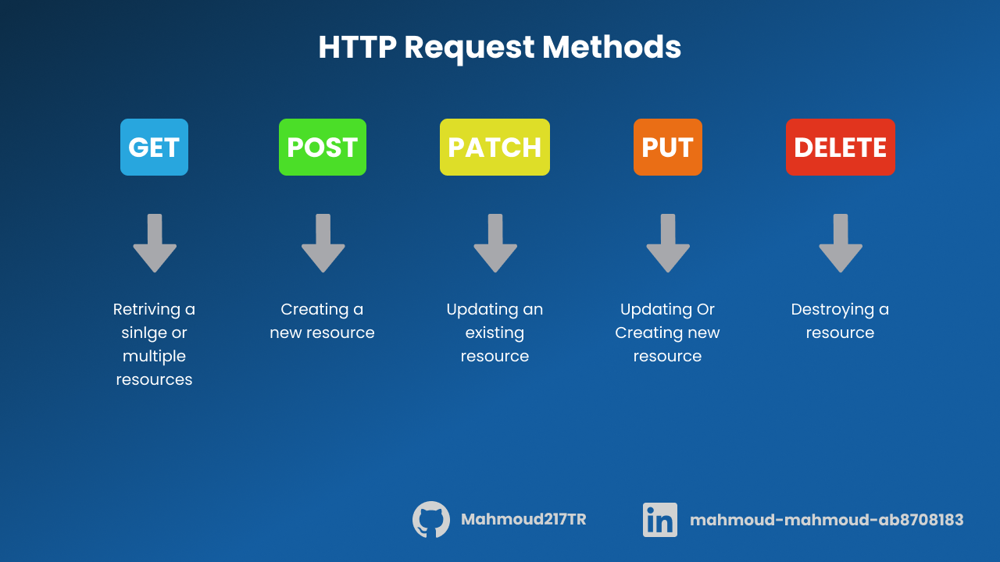
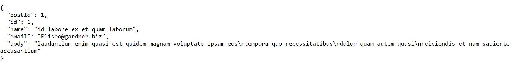
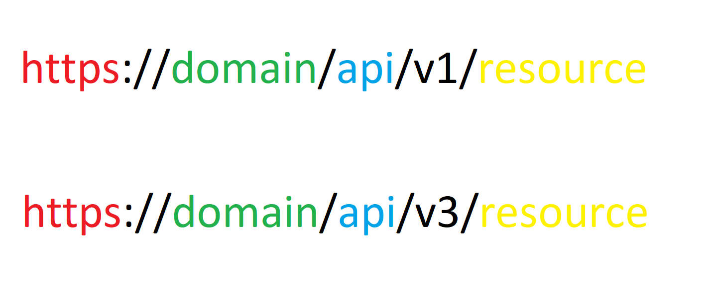
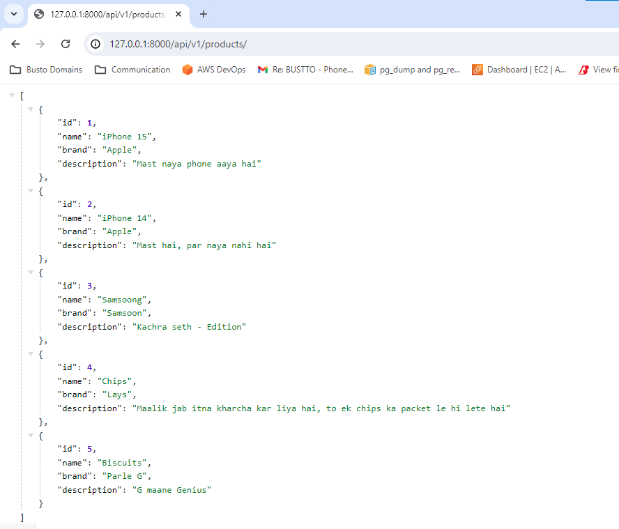
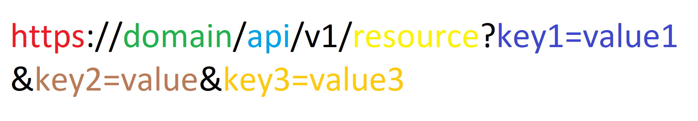
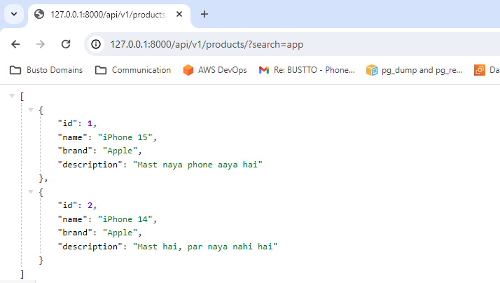
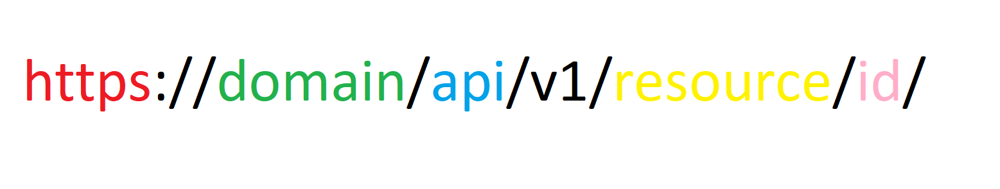
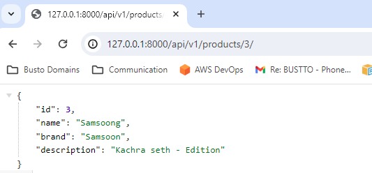
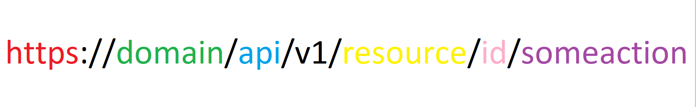
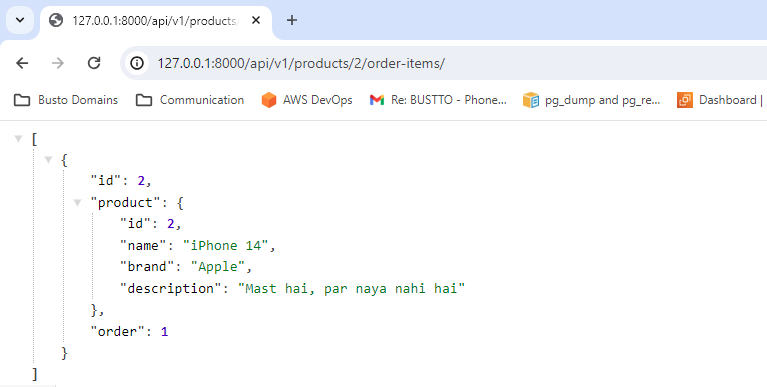

# Understanding API Endpoints: Identifying which Magic Spell to Use 🧝‍♂️

Hello everyone, hope you are doing well in this hot summer. I was trying a Third-Party Integration with my system, which got my attention on API URLs which I was integrating with.

Although it seems it just a URL which brings/updates some resource on the server, but knowing about URLs structure can tell you how the system was designed.

Let's dive into it!

Before making requests, we have to understand what the parts of requests are (to be precise HTTP requests)
There are three main parts of a HTTP request:
1) HTTP Method
2) Body
3) URL

## 1) HTTP Method
HTTP Method defines what actions to be taken on a particular resource (or entity). There are many HTTP methods but GET/POST/PUT/PATCH/DELETE are mostly used as per the requirements.

## 2) Body
Body denotes what data needs to be stored in server. This part of request is not required always. For e.g. if we just want to access or delete some data on server, sending data while requesting is useless. A typical JSON body structure while creating/updating a entity looks like this:

## 3) URLs:
Uniform Resource Locator or URL are the path to entity we can find it. It servers like an address. For e.g. when you want to meet your friend, for this you should know where to look for them or their address. 

Similarly the entities can be referred as:
 - HTML/CSS/JS files 
    e.g. https://en.wikipedia.org/wiki/URL  
    -> this will fetch HTML/CSS files which are located in Wikipedia’s server in wiki folder under named as URL

 - Images/Audio/Video/PPT/PDF files
    e.g. https://upload.wikimedia.org/wikipedia/commons/7/74/India-map-en.svg
    -> This URL will open a image named "India-map-en.svg" located inside at folder commons/7/74

 - Receiving data in some form like JSON/XML etc.
   e.g. https://jsonplaceholder.typicode.com/comments
   -> This URL will get JSON data in response

A typical structure of URL depends upon the requirements; however we can categorize three commonly seen structures

api/version -> denotes the version of URL, it allows to have a separation of older-newer system. API version is not mandatory, but considered as a good practice.
api/v1 -> version 1 of the system
api/v3 -> version 3 of the system (newer version)

### 3.1) Resource or entity address link
As discussed above resources can be any of the entity like files.

For e.g. https://mycoolsite😎.abcd/api/v1/dashing-harry-potter-image
This dummy URL will locate a image file named dashing-harry-potter-image file

But Resource can be the JSON data as well 

For e.g. https://jsonplaceholder.typicode.com/comments
This URL will locate JSON data of comments list.

 - GET method will retrieve list of entities
 - POST method will create a new entity

### 3.2) Query Parameters
Query Params are the part of URL which in which client sends some data while requesting.
Usually, these query params are used for filter (but can be used for new data addition which is not recommended). Typically query params link has following structure.

key1 is the parameter name with value params1.
key2 is the parameter name with value params2.
and so on...

Here search is query parameter name with value "app". This will filter products which has app in their name.
Now how to identify what are key and values to be provided, for this documentation must be referred or directly communicating with the developer who developed it.

### 3.3) Path Parameter
Path parameter denotes to target a specific entity. In following example identification of that specific entity is done by ID parameter

 - GET method will retrieve detail of the entity

 - PUT/PATCH: These two methods will update the record the data of that particular entity

 
 - DELETE: This method when used on URL with path parameter will delete the record of the entity from the database

#### 3.3.1) Specific action on Path Parameter
You can also perform some specific action on Path parameter URL, like downloading/uploading or getting data from related tables. 

URL structure looks like this.

I have used the last examples of getting all the Order Items in which Product with ID 3 was used.

Identify what the path to be provided, documentation has to be referred or directly communicating with the developer who developed it.

I hope you have found something interesting to learn. Till the bye 👋👋

